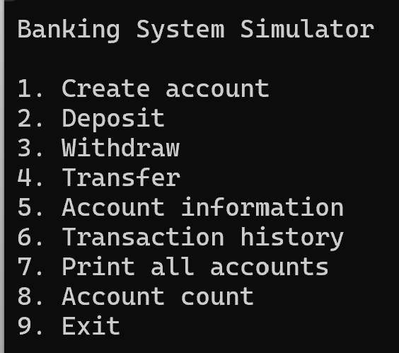
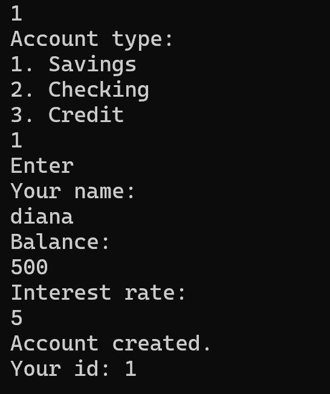
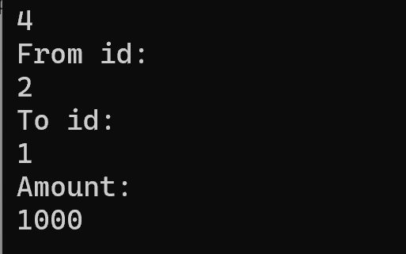
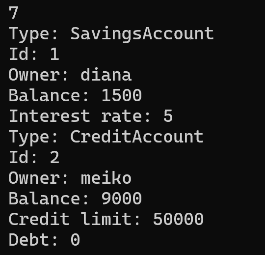

# Banking System Simulator

## Description

A console-based banking system simulator written in C++.

The project demonstrates object-oriented design principles and modern C++ (C++17) features through a banking system that supports multiple account types, transactions, and report generation.

## Features

- Create three types of bank accounts: Savings, Checking, and Credit
- Deposit and withdraw funds with validation
- Transfer money between accounts
- View account information and transaction history
- Generate reports for all accounts
- Exception handling for all invalid operations

## Account Types
 
| Type | Description |
|------|-------------|
| **Savings** | Earns interest via `applyInterest()`. Interest rate is set at account creation. |
| **Checking** | Supports overdraft up to a configured limit. Allows balance to go negative within the limit. |
| **Credit** | Has a credit limit and tracks debt. Deposits first pay off existing debt before adding to balance. |

## C++ Concepts Used
 
- **Object-Oriented Programming** — class hierarchy with inheritance and polymorphism (`Account` → `SavingsAccount`, `CheckingAccount`, `CreditAccount`)
- **Encapsulation** — private/protected fields with public interfaces
- **Operator Overloading** — `operator<<` for `Account` and `Transaction`
- **Templates** — generic `Report<T>` class for printing and filtering any collection
- **STL Containers** — `std::unordered_map`, `std::vector`
- **STL Algorithms** — `std::copy_if` with lambda predicates in `Report<T>::filterBy()`
- **Smart Pointers (RAII)** — `std::unique_ptr<Account>`
- **Exception Handling** — custom `BankException` inheriting from `std::runtime_error`
- **Modern C++ (C++17)** — `std::make_unique`, `enum class`, range-based loops

## UML Diagram

## Installation

Clone the repository:

```bash
git clone https://github.com/diiana7/banking-system-simulator
cd banking-system-simulator
```

## Build

**Requirements:** CMake 3.15+, C++17 compiler (MSVC, GCC, or Clang)
 
```bash
mkdir build && cd build
cmake ..
cmake --build .
```

## Project Structure

```
banking-system-simulator/
├── include/
│   ├── Account.h
│   ├── SavingsAccount.h
│   ├── CheckingAccount.h
│   ├── CreditAccount.h
│   ├── Transaction.h
│   ├── Bank.h
│   ├── Report.h
│   └── BankException.h
├── src/
│   ├── Account.cpp
│   ├── SavingsAccount.cpp
│   ├── CheckingAccount.cpp
│   ├── CreditAccount.cpp
│   ├── Transaction.cpp
│   ├── Bank.cpp
│   └── main.cpp
├── CMakeLists.txt
└── README.md
```

## How to use

## How to Use Run the application and interact with the console menu. Follow on-screen instructions to perform banking operations such as creating accounts, deposits, withdrawals, and transfers.
 
## Screenshots

### Main Menu



### Create Account



### Transfer



### Transaction History


### Print All Accounts


